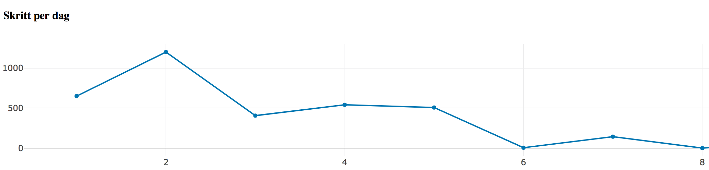

# Step Counter

This project contains a simple Android application for tracking your steps 
and a Python program for plotting a graph of your progress.
When everything is up and running will the Android application update the graf on the fly. 
The application will send your step count progress for each you connect the phone to power.
The graph will automatically show the latest results.



## Getting Started
In order for this to work, you would need to set up a Google Firebase project. It has to be done in the Firebase console.
```
https://console.firebase.google.com/ 
```
Navigate to Database -> RULES and set read/write to true. 
```
{
  "rules": {
    ".read": true,
    ".write": true
  }
}
```

......Will finish this later
